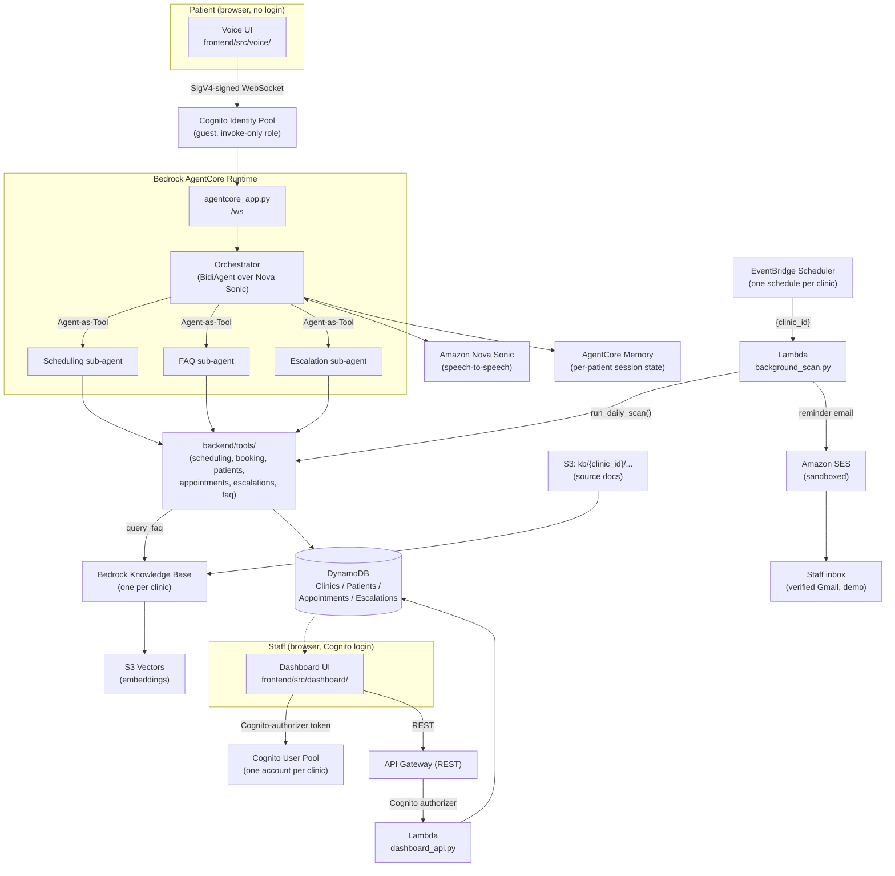

# Architecture Diagram

Source of truth for the design decisions behind this diagram is
[`context/architecture.md`](../context/architecture.md). This page is the
visual submission asset; if the two ever disagree, the context file wins and
this one should be updated to match.

## System diagram

## Reading the diagram

- **Everything is `clinic_id`-scoped.** DynamoDB partition keys, the
  Knowledge Base chosen per clinic, and the guest role's single permission
  (invoke the AgentCore runtime, nothing else) are the three structural
  reasons no request can cross a clinic boundary — see
  `context/architecture.md` → Invariants.
- **Sub-agents are never reachable directly.** The only caller of
  Scheduling, FAQ, and Escalation is the Orchestrator, wired in as
  Strands Agent-as-Tool. Nothing in the frontend or the API layer holds a
  reference to a sub-agent.
- **`backend/tools/` is the single source of truth for mutations.** Both
  the live Orchestrator (via its sub-agents) and the background Lambda
  (`background_scan.py`, via `automation.py`) call into this same layer —
  there is no second copy of the booking or escalation rules.
- **Two independent trust boundaries reach AWS**: a patient never
  authenticates and is issued a Cognito guest credential scoped to
  invoking the agent only; staff authenticate against a separate Cognito
  user pool whose claims gate every dashboard API route.

## Status

This diagram describes the architecture as designed and as built in code
and CDK (`backend/infra/`, verified via `cdk synth`). The stack has not yet
been deployed to a live AWS account from this environment — see
`context/progress-tracker.md` → Next Up and Session Notes for why (no
Docker, no usable AWS credentials, here specifically).
